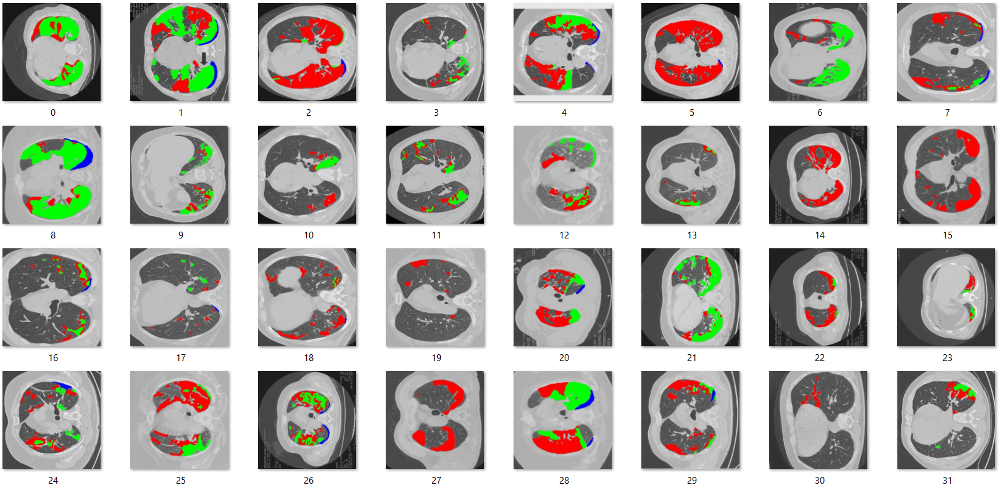

# Corona-Net: Diagnosis and Segmentation of the CoronavirusDisease 2019  
  

### Introduction  
  
Current baselines in biomedical image segmentation utilise fully-convolutional structures for the benefits of end-to-end trainability, size-invariance and efficiency. One such method is U-Net [1], a two-track contraction-expansion model which fuses features at different hierarchies with the objective of generating deep localisable features. Here, I introduce Corona-Net, a 3-part contribution dedicated to the classification, binary segmentation and multi-class segmentation of COVID-19. I first leverage the EfficientNet model [2] for COVID-19 diagnosis, achieving an accuracy of 93.89. I then utilise and refine the U-Net architecture for both binary and 3-class (ground-glass, consolidation, pleural effusion) segmentation of COVID-19 symptoms, through inference on the 100-slice COVID-19 CT segmentation (chest axial CT) dataset dataset [3]. Through strong data augmentation and rigorous experimentation, I overcome the small dataset size (100) to achieve a Dice Loss of 79.65% and 61.60%. Further training and testing on 2 newly discovered datasets will be conducted to ensure model performance. Through Corona-Net, I aim to develop a reliable, visual-semantically balanced method for automatic COVID-19 diagnosis, in order to contribute to the fight against this pandemic.  

### Results
1. Classification  
  
| Model | 1- BCE Loss | Optimiser | Learning Rate |
|-------|-------------|-----------|---------------|
| b0    | 0\.9237     | Adam      | 1e\-02        |
| b1    | 0\.9389     | Adam      | 1e\-03        |
| b2    | 0\.9085     | Adam      | 1e\-04        |  
  
2. Binary Segmentation

| Dice Coefficient | Rand Loss | Optimiser | Learning Rate |
|------------------|-----------|-----------|---------------|
| 0\.5641          | 0\.2167   | Adam      | 1e\-02        |
| 0\.7374          | 0\.1031   | Adam      | 1e\-03        |
| 0\.7965          | 0\.0766   | Adam      | 1e\-04        |
| 0\.4745          | 0\.1591   | Adam      | 1e\-05        |
  
3. Multi-Class Segmentation

| Dice Coefficient | Rand Loss | Optimiser | Learning Rate |
|------------------|-----------|-----------|---------------|
| 0\.5160          | 0\.2490   | Adam      | 1e\-02        |
| 0\.5900          | 0\.2114   | Adam      | 1e\-03        |
| 0\.6160          | 0\.1985   | Adam      | 1e\-04        |
| 0\.5001          | 0\.2565   | Adam      | 1e\-05        |
  
### Credits  
[1] O. Ronneberger, P. Fischer, and T. Brox.  U-Net:Convolutional  Networks  for  Biomedical  ImageSegmentation. INMICCAI, 2015.
[2] M. Tan and Q. V. Le. EfficientNet: Rethink-ing Model Scaling for Convolutional Neural Net-works In ICML, 2019.  
[3] Medical Segmentation.com  COVID-19 CT seg-mentation dataset, 2020.  
[4] M. Buda, A. Saha, and M. A. Mazurowski. Association of genomic subtypes of lower-grade gliomas with shape features automatically extracted by a deep learning algorithm. In Computers in Biology and Medicine, 2019.
